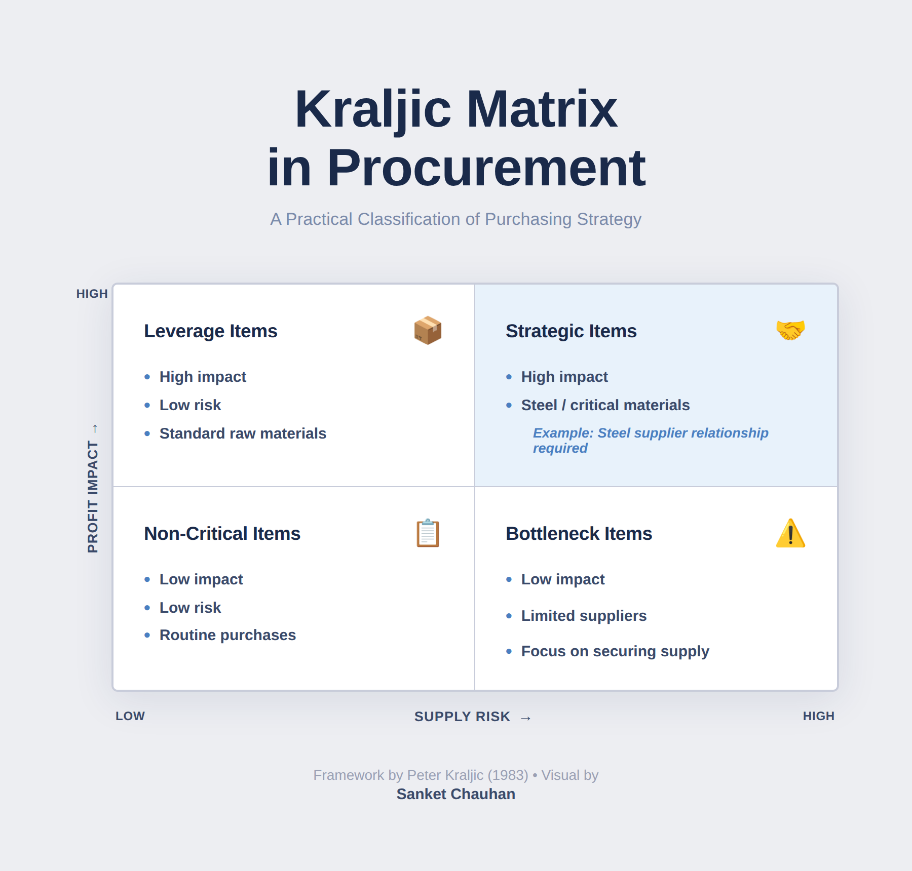

# 📦 Kraljic Matrix in Procurement

## 📌 Overview

This project applies the Kraljic Matrix framework to analyze supplier segmentation and optimize procurement strategy based on supply risk and profit impact.

The model enables organizations to categorize suppliers into strategic groups, allowing better decision-making, risk management, and cost efficiency in sourcing.

📍 Use Case: Applicable to manufacturing, retail, and FMCG procurement operations

---

## 📊 Model

➡️ The Kraljic Matrix classifies procurement items into four categories:

* **Strategic Items** (High Risk, High Impact): Require strong supplier relationships and long-term partnerships
* **Leverage Items** (Low Risk, High Impact): Focus on cost optimization and negotiation power
* **Bottleneck Items** (High Risk, Low Impact): Require risk mitigation and supply assurance
* **Non-Critical Items** (Low Risk, Low Impact): Focus on process efficiency and cost control

---

## 🎯 Objectives

* Improve supplier segmentation and sourcing strategy
* Reduce procurement risks
* Optimize cost and supplier performance

---

## 🔍 Key Insights

* Strategic suppliers require long-term collaboration
* Leverage items provide opportunities for cost reduction
* Bottleneck items need contingency planning
* Non-critical items should be managed for efficiency

---

## 💼 Business Impact

* Enhanced supplier relationship management
* Improved risk mitigation in procurement
* Better cost control and sourcing decisions
* Increased efficiency in procurement processes

---

## ⚙️ Tools & Concepts Used

* Kraljic Matrix (Supplier Segmentation Model)
* Procurement Strategy Framework
* Risk vs Impact Analysis
* Supplier Management Concepts

---

## 👤 Author

Sanket Chauhan
